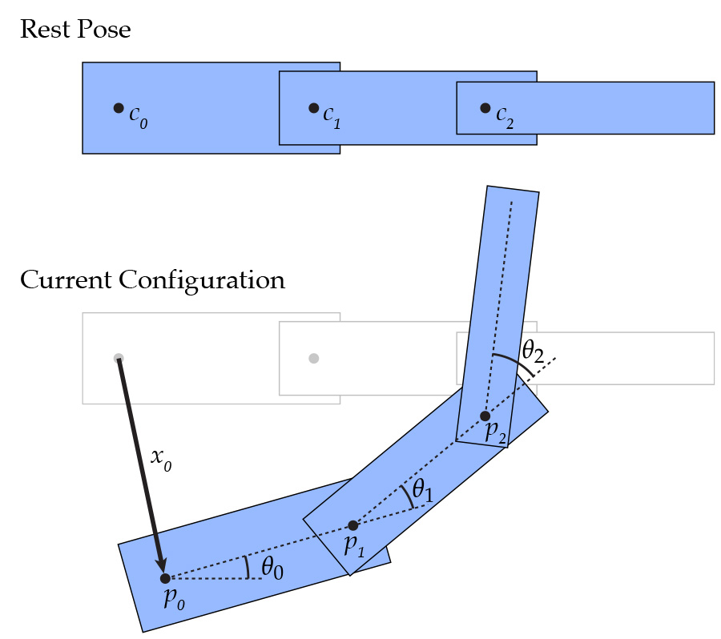
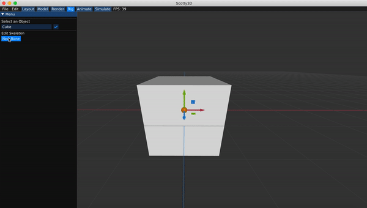
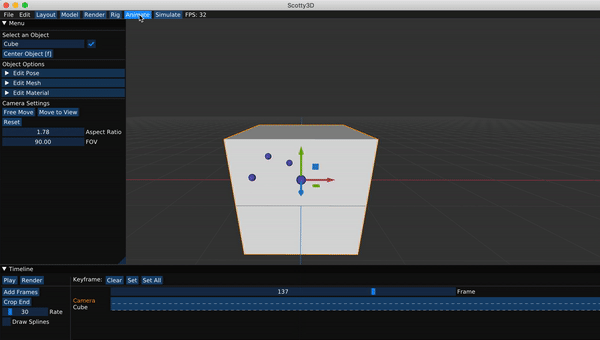

# Skeleton Kinematics

A `Skeleton`(defined in `scene/skeleton.h`) is what we use to drive our animation. You can think of them like the set of bones we have in our own bodies and joints that connect these bones. For convenience, we have merged the bones and joints into the `Joint` class which holds the orientation of the joint relative to its parent as euler angle in its `pose`, and `extent` representing the direction and length of the bone with respect to its parent `Joint`. Each `Mesh` has an associated `Skeleton` class which holds a rooted tree of `Joint`s, where each `Joint` can have an arbitrary number of children.

All of our joints are ball `Joint`s which have a set of $$3$$ rotations around the $$x$$, $$y$$, and $$z$$ axes, called _Euler angles_. Whenever you deal with angles in this way, a fixed order of operations must be enforced, otherwise the same set of angles will not represent the same rotation. In order to get the full rotational transformation matrix $$R$$, we can create individual rotation matrices around the $$X$$, $$Y$$, and $$Z$$ axes, which we call $$R_x$$, $$R_y$$ and $$R_z$$ respectively. The particular order of operations that we adopted for this assignment is that $$R := R_z \cdot R_y \cdot R_x$$.

### Forward Kinematics

_Note: These diagrams are in 2D for visual clarity, but we will work with a 3D kinematic skeleton._

When a joint's parent is rotated, that transformation should be propagated down to all of its children. In the diagram below, $$c_0$$ is the parent of $$c_1$$ and $$c_1$$ is the parent of $$c_2$$. When a translation of $$x_0$$ and rotation of $$\theta_0$$ is applied to $$c_0$$, all of the descendants are affected by this transformation as well. Then, $$c_1$$ is rotated by $$\theta_1$$ which affects itself and $$c_2$$. Finally, when rotation of $$\theta_2$$ is applied to $$c_2$$, it only affects itself because it has no children.

Before you proceed, there are a lot of different spaces where you will be working in. Here is a summary of each of the spaces:
*   Bind Joint space: The origin of this space corresponds to the start of joint $$i$$. Rotations of the joints (so-called "poses") are not considered in this space.
*   Posed Joint space: The origin of this space corresponds to the start of joint $$i$$ (based on the poses of all other joints). Rotations of the joints (so-called "poses") are considered in this space. 
*   Skeleton space: The origin of this space corresponds to the origin of the skeleton and no additional transformations are applied.
*   World space: The origin of this space is the origin of the world and no additional transformations are applied.

You will need to implement the following routines in `student/skeleton.cpp` for forward kinematics. Be careful in the order you apply translations and rotations!

*   `Joint::joint_to_bind`:
    Return a matrix transforming points in the joint space of this joint to points in skeleton space in bind position. You should traverse upwards from this joint's parent all the way up to the root joint and accumulate their transformations. An example would be transforming the origin in joint space to the beginning of the joint in relation to the other joints of the skeleton in skeleton space using only translations.
*   `Joint::joint_to_posed`:
    Return a matrix transforming points in the joint space of this joint to points in skeleton space in posed position. Again, you should traverse upwards from this joint's parent to the root joint and accumulate their transformations. An example would be transforming the origin in joint space to the beginning of the joint in relation to the other joints of the skeleton in skeleton space using both translations and rotations.
*   `Skeleton::end_of`:
    Returns the end position of the joint in world space when the joint is in bind position. This means you should take into account the base position of the skeleton (`Skeleton::base_pos`) to transform the position you get from skeleton space to world space.
*   `Skeleton::posed_end_of`:
    Returns the end position of the joint in world space when the joint is in posed position. This means you should take into account the base position of the skeleton (`Skeleton::base_pos`) to transform the position you get from skeleton space to world space.
*   `Skeleton::joint_to_bind`:
    Return a matrix transforming points in the joint space of this joint to points in skeleton space in bind position but with the base position of the skeleton taken in to account. Hint: use some function that you have implemented wisely!
*   `Skeleton::joint_to_posed`:
    Return a matrix transforming points in the joint space of this joint to points in skeleton space in posed position but with the base position of the skeleton taken in to account. Hint: use some function that you have implemented wisely!

Once you have implemented these basic kinematics, you should be able to define skeletons, set their positions at a collection of keyframes, and watch the skeleton smoothly interpolate the motion (see the [user guide](../guide/animate_mode) for an explanation of the interface). The gif below shows a very hasty demo defining a few joints and interpolating their motion.

Note that the skeleton does not yet influence the geometry of the cube in this scene -- that will come in Task 3!

### Task 2b - Inverse Kinematics

### Single Target IK

Now that we have a logical way to move joints around, we can implement Inverse Kinematics, which will move the joints around in order to reach a target point. There are a few different ways we can do this, but for this assignment we'll implement an iterative method called gradient descent in order to find the minimum of a function. For a function $$f : \mathbb{R}^n \to \mathbb{R}$$, we'll have the update scheme:

$$X_{k+1} = X_k - \tau \nabla f$$

Where $$\tau$$ is a small timestep. For this task, we'll be using gradient descent to find the minimum of the cost function:

$$f(\theta(t)) = \frac{1}{2}|p(\theta(t)) - q|^2$$

Where $$p(\theta(t))$$ is the end position of the target **joint** in skeleton space and $$q$$ is the position of the target **point** in skeleton space. More specifically, we'll be using a technique called Jacobian Transpose, which relies on the assumption:

$$\nabla_{\theta} f \approx \alpha J_{\theta}^T(p(\theta(t)) - q)$$

Where:

*   $$\alpha$$ is a constant.
*   $$J_\theta$$ is the Jacobian of $$\theta$$, which is a $$3 \times n$$ matrix.
*   $$\theta$$ is the function $$\theta(t) = \begin{bmatrix} \theta_1(t) & \theta_2(t) & \dots & \theta_n(t) \end{bmatrix}$$, where $$\theta_i(t)$$ is the angle of joint $$i$$ around the axis of rotation.

Notes: 
* $$n$$ refers to the number of joints in the skeleton. Although in reality this can be reduced to just the number of joints between the target joint and the root, inclusive, because all joints not on that path should stay where they are, so their columns in $$J_\theta$$ will be $$0$$. So $$n$$ can just be the number of joints between the target and the root, inclusive. 
* Since the above expression will get multiplied by $$\tau$$ anyways, you can ignore the value of $$\alpha$$, and just consider the timestep as $$\tau' = \tau \cdot \alpha$$.

Now we just need a way to calcluate the Jacobian of $$\theta$$. For this, we can use the fact that:

$$(J_\theta)_i = \overrightarrow{\textbf{r}} \times \overrightarrow{\textbf{p}}$$

Where:

*   $$J_i$$ is the $$i$$th column of $$J_\theta$$.
*   $$\overrightarrow{\textbf{r}}$$ is the axis of rotation in the current joint space.
*   $$\overrightarrow{\textbf{p}}$$is the vector from the base of joint $$i$$ to the end point of the target joint.

For a more in-depth derivation of Jacobian transpose (and a look into other inverse kinematics algorithms), please check out [this presentation](https://web.archive.org/web/20190501035728/https://autorob.org/lectures/autorob_11_ik_jacobian.pdf). (Pages 45-56 in particular)

Now, all of this will work for updating the angle along a single axis, but we have $$3$$ axes to deal with. Luckily, extending it to $$3$$ dimensions isn't very difficult, we just need to update the angle along each axis independently.

### Multi-Target

We'll extend this so we can have multiple targets, which will then use the function to minimize:

$$f(\theta(t)) = \frac{1}{2}\sum_i|p_i(\theta(t)) - q_i|^2$$

which is a simple extension actually. Since each term is independent and added together, we can get the gradient of this new cost function just by summing the gradients of each of the constituent cost functions!

You should implement multi-target IK, which will take a `vector` of `IK_Handle*`s called `active_handles` which stores the information a target point for a joint. See `scene/skeleton.h` for the definition of `IK_Handle` structure.

In order to implement this, you should update `Joint::compute_gradient` and `Skeleton::step_ik`. `Joint::compute_gradient` should calculate the gradient of $$\theta$$ in the rotated $$x$$, $$y$$, and $$z$$ directions, and add them to `Joint::angle_gradient` for all relevant joints. `Skeleton::step_ik` should actually do the gradient descent calculations and update the `pose` of each joint. In this function, you should use a small timestep, but do several iterations (say, $$10$$s to $$100$$s) of gradient descent in order to speed things up. For even faster and better results, you can also implement a variable timestep instead of a fixed one. Also note that the gradient descent should never affect `Skeleton::base_pos`. Don't forget to reset the gradients for each iteration!

A key thing for this part is to _remember what coordinate frame you're in_, because if you calculate the gradients in the wrong coordinate frame or use the axis of rotation in the wrong coordinate frame your answers will come out very wrong!

### Using your IK!
Once you have IK implemented, you should be able to create a series of joints, and get a particular joint to move to the desired final position you have selected.

Please refer to the [User Guide](../guide/rigging_mode) for more examples
