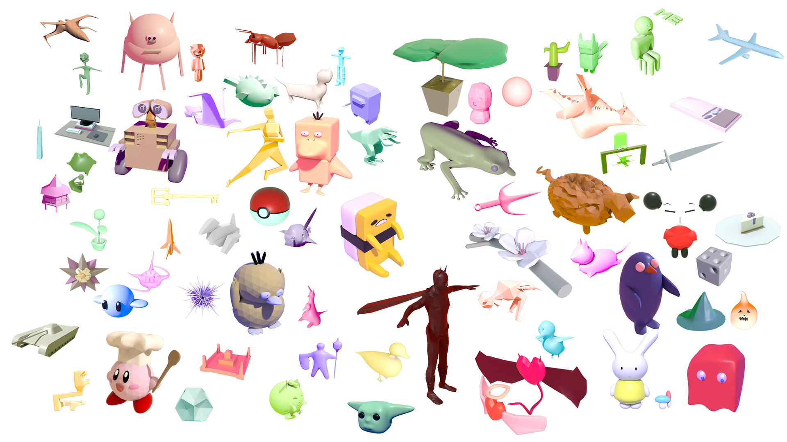

<!---->
<!---->

# Scotty3D

Welcome to Scotty3D! This 3D graphics software package includes components for interactive mesh
editing, realistic path tracing, and dynamic animation. Implementing functionality in each of these areas
constitutes the majority of the coursework for 15-462/662 (Computer Graphics) at Carnegie Mellon University

These pages describe how to set up and use Scotty3D. Start here!
- [Git Setup](git): create a private git mirror that can pull changes from Scotty3D.
- [Building Scotty3D](build): build and run Scotty3D on various platforms.
- [User Guide](guide): learn the intended functionality for end users.

The developer manual describes what you must implement to complete Scotty3D. It is organized under the three main components of the software:
- [Rasterizer](rasterizer)
- [MeshEdit](meshedit)
- [PathTracer](pathtracer)
- [Animation](animation)

## Project Philosophy

Welcome to your first day of work at Scotty Industries! Over the next few months
you will implement core features in Scotty Industries' flagship product
Scotty3D, which is a modern package for 3D modeling, rendering, and animation.
In terms of basic structure, this package doesn't look much different from
"real" 3D tools like Maya, Blender, modo, or Houdini. Your overarching goal is
to use the developer manual to implement a package that
works as described in the [User Guide](guide), much as you would at a real
software company (more details below).

Note that the User Guide is **not** an Assignment Writeup. The User Guide
contains only instructions on how to use the software, and serves as a
high-level specification of _what the software should do_. The Developer Guide
contains information about the internals of the code, i.e., _how the software
works_. This division is quite common in software development: there is a
**design specification** or "design spec", and an **implementation** that
implements that spec. Also, as in the real world, the design spec does _not_
necessarily specify every tiny detail of how the software should behave! Some
behaviors may be undefined, and some of these details are left up to the party
who implements the specification. A good example you have already seen is
OpenGL, which defines some important rules about how rasterization should
behave, but is not a "pixel-exact" specification. In other words, two different
OpenGL implementations from two different vendors (Intel and NVIDIA, say) may
produce images that differ by a number of pixels. Likewise, in this assignment,
your implementation may differ from the implementation of your classmates in
terms of the exact values it produces, or the particular collection of
corner-cases it handles. However, as a developer you should strive to provide a
solution that meets a few fundamental criteria:

*   [Failing gracefully](https://en.wikipedia.org/wiki/Fault_tolerance) is
preferable to failing utterly---for instance, if a rare corner case is difficult
to handle, it is far better to simply refuse to perform the operation than to
let the program crash!
*   Your implementation should follow the [principle of least
surprise](https://en.wikipedia.org/wiki/Principle_of_least_astonishment). A user
should be able to expect that things behave more or less as they are described
in the User Guide.
*   You should not use an algorithm whose performance is [asymptotically
worse](https://en.wikipedia.org/wiki/Asymptotic_computational_complexity) just
because it makes your code easier to write (for instance, using [bubble
sort](https://en.wikipedia.org/wiki/Bubble_sort) rather than [merge
sort](https://en.wikipedia.org/wiki/Merge_sort) on large data sets).
*   That being said, when it comes to performance, [premature optimization is
the root of all evil!](https://en.wikipedia.org/wiki/Program_optimization#When_to_optimize) The only way to know whether an optimization matters is to [measure performance](https://en.wikipedia.org/wiki/Profiling_(computer_programming)), and understand [bottlenecks](https://en.wikipedia.org/wiki/Program_optimization#Bottlenecks).
*   Finally, you should take pride in your craft. Beautiful things just tend to work better.

Just to reiterate the main point above:

**As in real-world software development, we will not specify every little detail
about how methods in this assignment should work!**

If you encounter a tough corner case (e.g., "how should edge flip behave for a
tetrahedron"), we want you to _think about what a good **design choice** might
be_, and implement it to the best of your ability. This activity is part of
becoming a world-class developer. However, we are more than happy to discuss
good design choices with you, and you should also feel free to discuss these
choices with your classmates. Practically speaking, it is ok for routines to
simply show an error if they encounter a rare and difficult corner case---as long as it
does not interfere with successful operation of the program (i.e., if it does
not crash or yield bizarre behavior). Your main goal here above all else should be
to develop _effective tool for modeling, rendering, and animation_.
